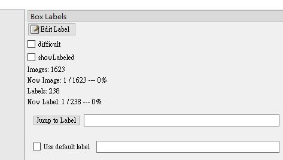

圖片辨識標註工具:
[官方地址](https://github.com/tzutalin/labelImg)

新增的工具:

1.勾選 showLabled 後 (按 A 選擇前一張 / D 選擇後一張) 可以直接顯示(前 / 後)一張標註過的圖片
2.顯示目前的資料夾中共有幾張(圖片 / 標註過的檔案)
3.顯示目前的(圖片 / 標註過的檔案)順序以及百分比
4.可直接跳到第 N 個標註過的檔案

